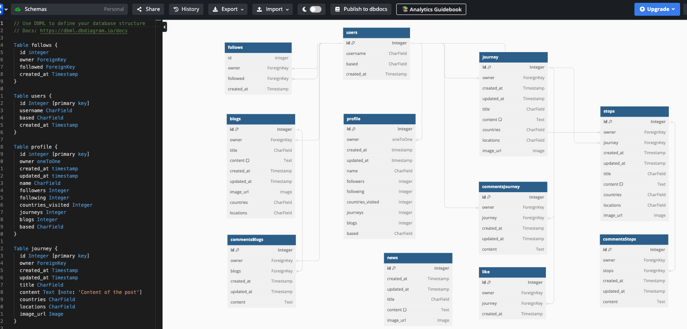

# Globetrotters
The Globetrotters API has been created and developed using the Django Rest Framework. This will serve as the back-end component to Globetrotters, an online social media platform dedicated to travel.

The front-end is created and developed using ReactJS. The two components are connected to provide an application that permits users to post their journeys and blogs with the world. Furthermore, to increase engagement on the platform, some basic functions are for users to like and comment on what other travellers have published. 

ElephantSQL is used to store data whilst Cloudinary is used to store images that are uploaded by users. Through the use of back-end and front-end components, users can perform CRUD (create, read, update and delete) functions.

The deployed API can be viewed here: https://globetrotter-b5d0296d5c65.herokuapp.com/

<br>

## Contents

[Planning & Development](https://github.com/lewis-worsley/globetrotter/blob/main/README.md#planning--development)

[Features](https://github.com/lewis-worsley/globetrotter/blob/main/README.md#features)

[Defensive Design](https://github.com/lewis-worsley/globetrotter/blob/main/README.md#defensive-design)

[Testing](https://github.com/lewis-worsley/globetrotter/blob/main/README.md#testing)

[Deployment](https://github.com/lewis-worsley/globetrotter/blob/main/README.md#deployment)

[Languages](https://github.com/lewis-worsley/globetrotter/blob/main/README.md#languages)

[Media](https://github.com/lewis-worsley/globetrotter/blob/main/README.md#media)

[Credits](https://github.com/lewis-worsley/globetrotter/blob/main/README.md#credits)

<br>

## Planning & development

To help implement the front-end, I used a few online services to ensure the data that is captured from the user is accurately stored in models and can be fetched through network requests. 

<br>

### API aims
<hr>

The API needs to be able to communicate with the front-end to efficiently and effectively for a seemless experience for the user and application. The API must/should be able to:

- communication to the front-end by accepting valid post and updated (put) data and send (get) data when called
- give users the opportunity to engage with journeys and blogs by liking and commenting posts
- offer users of the site to be able to follow and unfollow other accounts
- provide the users with the options to perform CRUD functions on their journeys, blogs and comments
- assist visitors with authentication, including sign up and sign in
- give readers the opportunity to view unique journeys, blogs and news
- let users view other profiles
- ensure unique journeys and blogs ids are associated with the correct unique owner id
- offer users the opportunity to update their profile


<br>

### User stories
<hr>

User stories for admin:

- As a Site Admin, I'd like to be able to create, read, update and delete news so that the website remains up-to-date

User stories for an authenticated user:

- be able to navigate across the website
- comment on other user's journeys and blogs
- like other user's journeys and blogs
- view other user's profiles
- follow and unfollow other users
- edit my profile
- create journeys and blogs
- sign in and out of my account
- view other user's journeys and blogs
- view the latest journeys, blogs and news

User stories for a non authenticated user:

- sign up to create an account
- view journeys, blogs and news
- view profiles

<br>

### Database Schema
<hr>

The application I used to draw my database schema was DBDiagram to help visualise how the models will look and operate in the backend.



<br>

## Features

The API contains the following features:

- Journeys
- Blogs
- News
- Likes
- Comments
- Followers
- Profiles

<br>

### Journeys
<hr>

​The journeys list page shows a list of all posts added from the front end; each individual journey detail can be viewed to:


- Journey list: [here](https://github.com/lewis-worsley/globetrotter-drf-api/tree/main/docs/features/journeys-list.png)
- Journey detail: [here](https://github.com/lewis-worsley/globetrotter-drf-api/tree/main/docs/features/journeys-detail.png)

<br>

### Blogs
<hr>

​The blogs list page shows a list of all posts added from the front end; each individual blog detail can be viewed to:

- Blog list: [here](https://github.com/lewis-worsley/globetrotter-drf-api/tree/main/docs/features/blogs-list.png)
- Blog detail: [here](https://github.com/lewis-worsley/globetrotter-drf-api/tree/main/docs/features/blogs-detail.png)

<br>

### News
<hr>

​The news list page shows a list of all posts added from the front end; each individual news detail can be viewed to:

- News list: [here](https://github.com/lewis-worsley/globetrotter-drf-api/tree/main/docs/features/news-list.png)
- News detail: [here](https://github.com/lewis-worsley/globetrotter-drf-api/tree/main/docs/features/news-detail.png)

<br>

### Likes
<hr>

Likes can be added to journeys and blogs so a user can like or unlike a journey or blog on the front end. 

- Journey like list: [here](https://github.com/lewis-worsley/globetrotter-drf-api/tree/main/docs/features/likes-list-journeys.png)
- Journey like detail: [here](https://github.com/lewis-worsley/globetrotter-drf-api/tree/main/docs/features/likes-detail-journeys.png)
- Blog like list: [here](https://github.com/lewis-worsley/globetrotter-drf-api/tree/main/docs/features/likes-list-blogs.png)
- Blog like detail: [here](https://github.com/lewis-worsley/globetrotter-drf-api/tree/main/docs/features/likes-detail-blogs.png)

<br>

### Comments
<hr>

Comments can be added to journeys and blogs. A user can create, edit or delete a comment.

- Journey comment list: [here](https://github.com/lewis-worsley/globetrotter-drf-api/tree/main/docs/features/comments-list-journeys.png)
- Journey comment detail: [here](https://github.com/lewis-worsley/globetrotter-drf-api/tree/main/docs/features/comments-detail-journeys.png)
- Blog comment list: [here](https://github.com/lewis-worsley/globetrotter-drf-api/tree/main/docs/features/comments-list-blogs.png)
- Blog comment detail: [here](https://github.com/lewis-worsley/globetrotter-drf-api/tree/main/docs/features/comments-detail-blogs.png)

<br>

### Followers
<hr>

Users on the front-end have the ability to follow or un-follow each other thanks to the API. A follow is created for each 'follow' and destroyed each time a user clicks 'unfollow'.

- Followers list: [here](https://github.com/lewis-worsley/globetrotter-drf-api/tree/main/docs/features/list-followers.png)
- Followers detail: [here](https://github.com/lewis-worsley/globetrotter-drf-api/tree/main/docs/features/detail-followers.png)

<br>

### Profiles
<hr>

The API allows the back-end to record each time a new profile is created.

- Followers comment list: [here](https://github.com/lewis-worsley/globetrotter-drf-api/tree/main/docs/features/list-profiles.png)
- Blog comment detail: [here](https://github.com/lewis-worsley/globetrotter-drf-api/tree/main/docs/features/detail-profiles.png)

<br>


## Defensive Design

Serializers contain permission checks to grant or deny access to users depending on their status and ownership. Essentially, this means ensuring only owners can edit and delete their journeys, blogs and comments - users will be presented with a '401 Unauthorised' or ' 403 Forbidden response.

<br>

## Testing

As I was exclusively working with Python files, I used https://pep8ci.herokuapp.com/ to validate Python files.

The testing process, along with bugs, can be viewed [here](https://github.com/lewis-worsley/globetrotter-drf-api/blob/main/TESTING.md).

<br>

## Deployment

### Initial Deployment
<hr>

I took the following steps to deploy the site to Heroku and have listed any console commands required to initiate it. My aim was to ensure this process was completed as early as possible in the project, to avoid complications or issues as it progressed.


### Create repository:
<hr>

-   Create a new repository in GitHub and clone it locally following [these instructions](https://docs.github.com/en/repositories/creating-and-managing-repositories/cloning-a-repository)
    -   **Note** - If you are cloning my project, then you can skip all pip installs below and just run the following command in the terminal to install all the required libraries/packages at once:
        -   pip install -r requirements.txt
    -   **IMPORTANT** - If developing locally on your device, ensure you set up/activate the virtual environment ([see below](#setting-up-the-workspace-to-be-done-locally-via-the-console-of-your-chosen-editor)) before installing/generating the requirements.txt file; failure to do this will pollute your machine and put other projects at risk

#### Setting up the Workspace (To be done locally via the console of your chosen editor):
<hr>

1. Create a virtual environment on your machine (Can be skipped if using gitpod):
    - python -m venv .venv
1. To ensure the virtual environment is not tracked by version control, add .venv to the .gitignore file.
1. Install Django 3.2 alongside gunicorn:
    - `pip3 install 'django<4' gunicorn`
    - **Note:** Django 3.2 is the _LTS_ (Long term support) version which is preferable to use over the Django 4 beta.
1. Install supporting libraries:
    - `pip install dj_database_url==0.5.0 psycopg2`
    - `pip install dj3-cloudinary-storage`
1. Create requirements.txt:
    - `pip freeze --local > requirements.txt`
1. Create an empty folder for your project in chosen location.
1. Create a project in the above folder:
    - `django-admin startproject PROJECT_NAME .` (in the case of this project, the project name was "sfportal")
1. Create an app within the project:
    - `python3 manage.py startapp APP_NAME` (in the case of this project, the app name was "sfblog")
1. Add new app to bottom of the list of installed apps in settings.py and save file
1. Migrate changes:
    - `python3 manage.py migrate`
1. Test server works locally:
    - `python3 manage.py runserver` (This should display the default Django success page)

#### Using JWT tokens
<hr>

1. In the *terminal*: `pip install `pip install dj-rest-auth==2.1.9`
    - in *settings.py*: `INSTALLED_APPS = [ ...
                        'django_filters',
                        'rest_framework.authtoken', 'dj_rest_auth',
                        ‘profiles’,
                        ... ]`
    - in main *urls.py* file:
    `urlpatterns = [ ...,
        path('api-auth/', include('rest_framework.urls')),
        path('dj-rest-auth/', include('dj_rest_auth.urls')),
        path('', include('profiles.urls')), ....,]`
    - in the *terminal*, migrate the database: `python manage.py migrate`

#### Adding feature to register users
<hr>

1. In the *terminal*, install Django all-Auth: `pip install 'dj-rest-auth[with_social]'`
    - In *settings.py*, add relevant apps to installed apps:
    `INSTALLED_APPS = [ ...,
        'dj_rest_auth',
        'django.contrib.sites', 'allauth',
        'allauth.account', 'allauth.socialaccount', 'dj_rest_auth.registration',
        'profiles',
        ..., ]`
    - Add site id value under installed apps list: `SITE_ID = 1`
    - In *main urls.py file*, add registration urls to the url patterns list:
    `urlpatterns = [ ...,
        path('dj-rest-auth/', include('dj_rest_auth.urls')),
        path('dj-rest-auth/registration/', include('dj_rest_auth.registration.urls')),
        path('', include('profiles.urls')), ...,
        ]`

#### Adding JWT Tokens functionality
<hr>

1. In the *terminal*: `pip install djangorestframework-simplejwt==4.7.2`
    - In *env.py*, differentiate between Dev and Prod mode: `os.environ['DEV'] = 1`
    - In *settings.py*:
    `REST_FRAMEWORK = { 'DEFAULT_AUTHENTICATION_CLASSES': [(
        'rest_framework.authentication.SessionAuthenticatio n'
        if 'DEV' in os.environ
        else 'dj_rest_auth.jwt_auth.JWTCookieAuthentication'
    )] }`
    - enable token authentication: `REST_USE_JWT = True`
    - `JWT_AUTH_COOKIE = 'my-app-auth'`
    Declare cookie names for access and refresh tokens: 
    `JWT_AUTH_SECURE = True JWT_AUTH_REFRESH_COOKIE = 'my-refresh-token'`


#### Add profile id and profile image fields
<hr>

1. Create a new *serializers.py file*: e.g. `barbelles_api / serializers.py`
    - in the new serializers.py file, import: 
    `from dj_rest_auth.serializers import UserDetailsSerializer from rest_framework import serializers`
    - create profile_id and profile_image fields: 
    `class CurrentUserSerializer(UserDetailsSerializer): 
        profile_id = serializers.ReadOnlyField(source='profile.id') 
        profile_image = serializers.ReadOnlyField(source='profile.image.url') 

    class Meta(UserDetailsSerializer.Meta):
        fields = UserDetailsSerializer.Meta.fields + ('profile_id', 'profile_image')`
    - overwrite the default serializer **place under JWT_AUTH_REFRESH_COOKIE**: 
    `REST_AUTH_SERIALIZERS = {'USER_DETAILS_SERIALIZER': 'drf_api.serializers.CurrentUserSerializer'}`

    - In the *terminal*:
    - `python manage.py migrate`
    - `pip freeze > requirements.txt`
    - Add, commit and push

#### Add the root route
<hr>

1. In the IDE / terminal, create a *views.py* file: e.g. `barbelles_api / views`
    - in the new *views.py* file, import: 
    `from rest_framework.decorators import api_view 
     from rest_framework.response import Response`
    - create root route and return custom message: 
    `@api_view()
    def root_route(request):
    return Response({"message": "Welcome to my django rest framework API!"})`
    - set imports: `...
                    from .views import root_route`
    - add *url patterns* to list: 
    `urlpatterns = [ ...,
    path('', root_route)
    ]`

<br>

#### Adding Cloudinary
<hr>

1. In *settings.py*, add Cloudinary:

    - Add Cloudinary libaries to installed apps:
    ```
    'cloudinary_storage',
    'django.contrib-staticfiles',
    'cloudinary',
    ```
    - For Cloudinary to operate, the static files should appear as follows:
    ```
    CLOUDINARY_STORAGE = {
        'CLOUDINARY_URL': os.environ.get('CLOUDINARY_URL')
    }
    
    MEDIA_URL = '/media/'
    DEFAULT_FILE_STORAGE = 'cloudinary_storage.storage.MediaCloudinaryStorage'
    ```

<br>

#### Adding JSON renderer
<hr>

1. In *settings.py*, add pagination:
    ```
    REST_FRAMEWORK = { ...,
    'DEFAULT_PAGINATION_CLASS': 'rest_framework.pagination.PageNumberPagination',
    'PAGE_SIZE': 10,
    }
    ```
    - set JSON renderer if DEV environment not present:
    ```
    REST_FRAMEWORK = { ...
    }
    if 'DEV' not in os.environ:
    REST_FRAMEWORK['DEFAULT_RENDERER_CL ASSES'] = [
    'restframework.renderers.JSONRenderer' ]
    ```

<br>

#### Date and time formatting
<hr>

1. In *settings.py*: 
    ```
    REST_FRAMEWORK = { ...
    'DATETIME_FORMAT': '%d %b %Y'
    }
    ```
    - In *comments.serializers.py*, set imports:
    ```
    ...
    from django.contrib.humanize.templatetags.humanize
    import naturaltime
    ```
    - Set fields in *comment serializer class*:
    ```
    created_at = serializers.SerializerMethodField()
    updated_at = serializers.SerializerMethodField()
    ```
    - set methods underneath fields: 
    ```
    def get_created_at(self, obj):
        return naturaltime(obj.created_at)
    def get_updated_at(self, obj):
        return naturaltime(obj.updated_at)
    ```
    - Add, commit and push changes

### Deploying an App to heroku
<hr>

#### Create a New External Database:
<hr>

For the purposes of this project I used ([ElephantSQL](https://www.elephantsql.com/)) and the following assumes you already have an account:

1. Log in to your account
    - Click "Create new instance"
1. Set up your plan:
    - Give your project a name (commonly the name of your project)
    - Select the Tiny Turtle (Free) plan
    - Tag fields can be left blank
1. Select the nearest location:
    - For me, this was Ireland.
    - Click review and then 'Create Instance'
1. Return to the ElephantSQL dashboard:
    - Click on the **database instance name** for this project:
    - Copy your **ElephantSQL** _database URL_ (It will start with postgres://)

#### Create Heroku App:
<hr>

The below works on the assumption that you already have an account with [Heroku](https://id.heroku.com/login) and are already signed in.

1. Create a new Heroku app:
    - Click "New" in the top right-hand corner of the landing page, then click "Create new app."
1. Give the app a unique name:
    - It will form part of the URL (in the case of this project, I called the Heroku app sci-fi-portal)
1. Select the nearest location:
    - For me, this was Europe.
1. Add Database to the Heroku app:
    - Open _settings_ tab and click **Reveal Config Vars**
    - Add a Config Var called **DATABASE_URL**
    - **NOTE:** The **value** should be the ElephantSQL database url copied in the previous step.
1. From your editor, go to your projects settings.py file and copy the SECRET_KEY variable. Add this to the same name variable under the Heroku App's config vars.
    - left box under config vars (variable KEY) = SECRET_KEY
    - right box under config vars (variable VALUE) = Value copied from settings.py in project.

#### Connect to the Database
<hr>

I used **gitpod** for this project:

1. In **gitpod**:
   ** In the terminal **
   _ Install dj_database_url: `pip install dj_database_url`
   _ in **settings.py**:
   _ Import library: `import dj_database_url`
   _ Separate the Dev and Prod environments: 
        ```
       DATABASES = {
            'default': ({
                'ENGINE': 'django.db.backends.sqlite3', 'NAME': BASE_DIR / 'db.sqlite3',
            } if 'DEV' in os.environ else dj_database_url.parse(
                os.environ.get('DATABASE_URL')
            ))
        }
        ```
    * In the **terminal**:
    Install gunicorn: `pip install gunicorn`    
    * Create **Procfile**
    * In Procfile:`release: python manage.py makemigrations && python manage.py migrate
   web: gunicorn drf_api.wsgi`
    - in **settings.py**: set the allowed hosts: `ALLOWED_HOSTS = ['<YOURAPPNAME>.herokuap p.com', 'localhost']`
    - in the **terminal**: `pip install django-cors-headers`
    - in **settings.py**, add cors headers: 
                            ```
                            INSTALLED_APPS = [ ...
                            'dj_rest_auth.registration',
                            'corsheaders',
                            'profiles',
                            ... ]
                            ```
    - add to middleware:    
                            ```
                            MIDDLEWARE = [
                            'corsheaders.middleware.Cors Middleware',
                            ... ]
                            ```
                        
    - set the ALLOWED_ORIGINS for network request made by the server:
    `if 'CLIENT_ORIGIN' in os.environ: CORS_ALLOWED_ORIGINS =[
        os.environ.get('CLIENT_ORIGIN') ]
    else:
        CORS_ALLOWED_ORIGIN_RE GEXES = [
        r"^https://.*\.gitpod\.io$", ]`

    - Allow *cookies*: `CORS_ALLOW_CREDENTIALS = True`

    - Allow front and backend sites to be deployed to different platforms: `JWT_AUTH_SAMESITE = 'None'`

1. Set the remaining **environment variables**:
    - in **env.py**: `os.environ['SECRET_KEY'] = 'CreateRandomValue'`
    - in **settings.py**, replace insecure key with the environment variable: 
    `SECRET_KEY = os.environ.get('SECRET_KEY')`
    - replace the DEBUG setting to be only true in Dev and False modes: `DEBUG = 'DEV' in os.environ`

1. In **Heroku**:
    - Add Secret Key to Config Vars: **SECRET_KEY (value:) "Made up secret key"**
    - Add `DISABLE_COLLECTSTATIC = 1` config var
    - For this project it was also necessary to add **PORT 8000**

1. In the **terminal**: `pip freeze > requirements.txt` and push changes to GitHub


#### Connect the project's github repo to Heroku
<hr>

1.  In **Heroku**:
    - Select the deployment method, e.g. *GitHub*
    - Select the project repo name from GitHub and then connect
    - In the deploy section choose *master branch*
    - Click *deploy branch*
    - Open app to view

1.  In the **terminal**:

    -   **SAVE ALL FILES** Make an initial commit and push the code to the GitHub Repository.

    `git add .
    git commit -m "Initial deployment"
    git push`

1. **FINAL DEPLOYMENT**
    In *settings.py*
    - Set `DEBUG = False`

    In *Heroku*
    - Remove 'disable_collectstatic' variable
    - Select *Deploy branch*


#### Cloning on a Local machine or Via Gitpod Terminal
<hr>

1. Navigate to the GitHub repository, and follow these steps to clone the project into your IDE of choice.

    - **Gitpod** only requires you to have the web extension installed and click the green Gitpod button from the repositories main page. If you are using Gitpod, please skip step 2 below as you do not require a virtual environment to protect your machine.

1. Create the virtual environment with the terminal command **`python3 -m venv venv`.** Once complete add the "venv" file to your ".gitignore" file and use the terminal command **`venv\Scripts\activate.bat`** to activate it.

    - **_IMPORTANT_** If developing locally on your device, ensure you _set up/activate the virtual environment before installing/generating the requirements.txt file_; failure to do this will pollute your machine and put other projects at risk.

1. **Install the requirements** listed in _requirements.txt_ using the terminal command **`pip3 install -r requirements.txt`**

Please note that since the project has been developed from scratch, I have installed required libraries as the project progressed. I have already included a requirements.txt for this app by using the **terminal command** `pip3 freeze > requirements.txt` to generate it.

1. **[Create your own Heroku app](create-heroku-app)** and update allowed hosts in settings.py.

1. **[Create your .env file](#attach-the-database)**

1. **Run server locally with `python3 mange.py runserver`**

<br>

## Languages, frameworks & software

- Python
- Cloudinary
- Django
- Django Cors Headers
- Django Rest Auth
- Django Rest Framework
- ElephantSQL
- Heroku
- Pillow

<br>

## Media

Default images provided by Code Institute for profile, journeys and blogs.

<br>

## Credits

To help bring this project to life, the following deserve recognition:

<br>

### Thanks
<hr>

- Richard Wells
    - With his help and guidance I was able to successfully build a project I'm proud of which included building the back and front ends

- Code Institute
    - For displaying how to create an API and connect it to the front-end with ReactJS